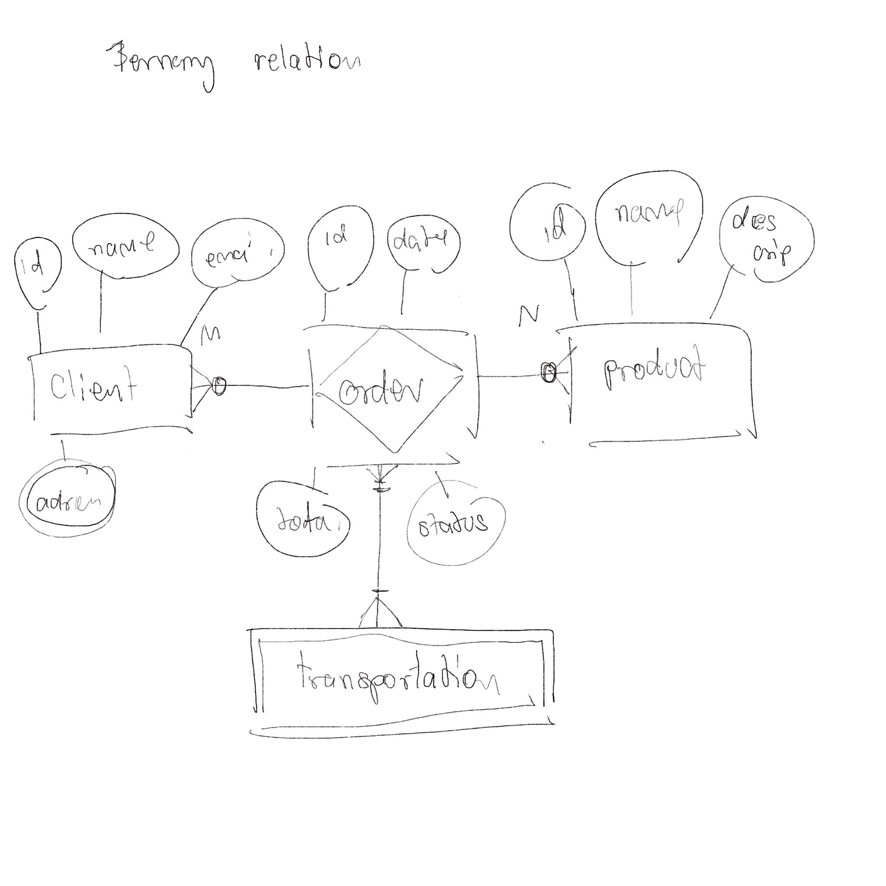

## 1. Avancerad SQL och Normalisering  

   **a) Beskriv en komplex databasstruktur du har arbetat med (eller skapa en hypotetisk struktur med minst 4 relaterade tabeller**

Jag börjar med att skapa fyra relaterade tabeller: Product, Order, Customer, Transportation, och OrderDetail.

**product tabellet**
- product_id : innerhåller product id och det är increment
- product_name : innerhåller product name med varchar (255)
- product_price : innerhåller product price med decimal data type.
- product_description : innerhåller product description med varchar (255)

 **order tabellet**
- order_id : innerhåller order id och det är increment
- order_date : innerhåller order date med date data type
- order_status : innerhåller order status med varchar (255)
- order_total : innerhåller order total med integer data type.
- kunde_id : innerhåller kunde id med foreign key
- transportation_id : innerhåller transportation id med foreign key

 **kunde tabellet**
- client_id : innerhåller kunde id och det är increment
- client_name : innerhåller kunde name med varchar (255)
- client_email : innerhåller kunde email med varchar (255)
- client_phone : innerhåller kunde phone med varchar (255)

 **transportation tabellet**
- transportation_id : innerhåller transportation id och det är increment
- transportation_name : innerhåller transportation name med varchar (255)

**order detail**
- orderdetail_id innehåller beställing detailj id
- order_id : innerhåller order id med foreign key.
- product_id : innerhåller product id med foreign key
- quality : innerhåller totalt av varor som beställas med int data type.
- price : innerhåller totalt pris med decimal data type.

Mina tankar är baserade på ett diagram som jag först skissade för hand, för att kunna se relationerna mellan tabellerna, som om de är en-till-många eller många-till-många, och om det finns någon tertiär relation. Order ska fungera som en entitet som kopplar ihop Product och Customer, samt Transportation.
Det är viktigt att förstå relationerna mellan tabellerna innan man skapar dem. Diagrammet hjälper till att visualisera detta, men det är också viktigt att tänka på schema-designen. Ett schema visar både primärnycklar (PK) och främmande nycklar (FK), vilket gör det lättare att förstå vad som ska finnas i varje tabell.



**shema som skriva jag efteråt** 
- client: [client_id (PK), name, email]
- product : [product_id (PK), product_name, product_description, product_price]
- order : [order_id (PK), order_date, order_status, client.id(Fk to client)]
- order_detail : [orderdetail_id (PK), product_id (FK to product),order_id(FK to product), quantity,price]
- transport :[ transport_id (PK), transport_name]

Efter att jag skapat tabellerna började jag sätta relationer mellan dem. När jag ritade ER-diagrammet valde jag att representera Customer och Product som huvudobjekt (subject), medan Order och Transport fungerar som relationer (verb) mellan kunder och produkter. Detta gör det tydligare för mig att förstå hur relationerna ska struktureras, vilket illustreras i diagrammet.
Tabellerna är baserade på en många-till-många-relation, eftersom en kund kan beställa flera produkter, och varje produkt kan beställas av flera kunder. Detta ger en många-till-många-relation mellan Customer och Product via Order.
När det gäller Transport blir det lite mer komplext. Transport kan ses som både ett subjekt och ett verb, men i mitt fall har jag valt att betrakta det som ett subjekt. Relationen mellan Order och Transport är också många-till-många, eftersom en transport kan leverera flera beställningar, och en beställning kan levereras med flera olika transporter.


   **b) Skriv en avancerad SQL-fråga som involverar minst två JOIN-operationer och en sub-fråga. Förklara hur frågan fungerar och varför den är strukturerad på detta sätt.**  
   
   Jag vill veta vilken kund som har beställt fler än 10 artiklar och den totala beställningen per kund.
```sql
SELECT C.Name, O.OrderID, SUM(OD.Quantity) AS TotalQuantity
FROM Customers C
JOIN Orders O ON C.CustomerID = O.CustomerID
JOIN OrderDetails OD ON O.OrderID = OD.OrderID
WHERE O.OrderID IN (SELECT OrderID FROM OrderDetails GROUP BY OrderID HAVING SUM(Quantity) > 10)
GROUP BY C.Name, O.OrderID;
```
En effektiv metod för att hämta data är att använda en subquery för att först räkna en summa (t.ex. summan av en beställning) och sedan filtrera med en WHERE-sats. Subqueryn hämtar och summerar relevant data, och i WHERE-satsen används den för att filtrera så att endast de poster som matchar med t.ex. OrderID inkluderas i huvudfrågan.
Efter att subqueryn har filtrerat beställningarna (med hjälp av OrderID) används JOIN-satser för att koppla ihop flera tabeller, såsom Customers, Orders och OrderDetails. Detta gör att man kan hämta relaterad information från dessa tabeller, t.ex. CustomerID och OrderID, vilket ger en komplett bild av de data man är intresserad av.
Till slut summeras den filtrerade datan för varje order, och den sorteras enkelt för att få en strukturerad översikt.

   **c) Analysera din databasstruktur ur ett normaliseringsperspektiv. Identifiera vilken normaliseringsform den uppfyller och motivera ditt svar.**

Jag använder 3NF (tredje normalformen) eftersom jag försöker undvika transitiv beroende i databasen, så att det inte finns några transitiva beroenden mellan icke-nyckelfälten. Därför skapas separata tabeller mellan dem.

**Unnormalized Form (UNF)**

| Order ID | Customer Name | Product Names        | Product Quantities | Order Date  |
|----------|---------------|----------------------|--------------------|-------------|
| 1        | Alice Smith   | Apples, Bananas      | 5, 2               | 2024-10-20  |
| 2        | Bob Johnson    | Oranges              | 3                  | 2024-10-21  |
| 3        | Alice Smith   | Bananas, Grapes      | 2, 1               | 2024-10-22  |

efter gjorde normalisering.

**Customers Table**

| Customer ID | Customer Name | 
|-------------|---------------|
| 1           | Alice Smith   |
| 2           | Bob Johnson    |

**Orders Table**

| Order ID | Customer ID | Order Date  |
|----------|-------------|-------------|
| 1        | 1           | 2024-10-20  |
| 2        | 2           | 2024-10-21  |
| 3        | 1           | 2024-10-22  |

**Order Details Table**

| Order ID | Product ID | Product Quantity |
|----------|------------|------------------|
| 1        | 1          | 5                |
| 1        | 2          | 2                |
| 2        | 3          | 3                |
| 3        | 2          | 2                |
| 3        | 4          | 1                |

**Products Table**

| Product ID | Product Name | 
|------------|--------------|
| 1          | Apples       |
| 2          | Bananas      |
| 3          | Oranges      |
| 4          | Grapes       |


## 2. Databasdesign och Alternativa Lösningar:  
 **a) Föreslå minst två förbättringar till din databasdesign. Motivera varför dessa förbättringar skulle vara fördelaktiga.**  
    
 - I Customer-tabellen kan adressen delas upp i separata fält, såsom gata och lägenhetsnummer, för att underlätta sökning.
 - Jag funderar på relationerna mellan tabellerna. Istället för att använda separata primärnycklar kan man använda en sammansatt primärnyckel bestående av (order_id, product_id). Detta innebär att det direkt länkar till både Order och Product, vilket minskar dataduplicering. Det är viktigt att tänka på att kunder kan beställa samma produkt flera gånger, och varje gång dyker produkten upp i OrderDetail.
 - I OrderDetail kan det läggas till ett fält för datum för senaste uppdatering. Detta är användbart för dem som arbetar med att kolla orderstatus, så att de också kan se när beställningen senast uppdaterades. Detta underlättar när man följer upp ärenden med kunderna.

    **b) Diskutera minst ett alternativt sätt att strukturera din databas. Jämför för- och nackdelar mellan din ursprungliga design och det alternativa förslaget.**
    
    Man kan också skapa en separat tabell för Invoice för att hantera fakturor och kvitton, vilket skulle ha en relation med Order. Stored procedures och transaktioner kan användas i detta sammanhang eftersom de gör det enklare och smidigare att samla alla queries i en stored procedure och bara anropa den. Dessutom kan transaktioner hjälpa till att kontrollera tillståndet för queryn. Ibland kan oväntade händelser inträffa när man beställer varor, och då kan rollback användas för att återställa systemet. Jag tror att detta kan leda till bättre prestanda och snabbhet.
    Samtidigt kan detta öka komplexiteten och göra systemet mer komplicerat, eftersom det kan skapa fler beroenden och relationer mellan tabellerna. Om man gör ett felaktigt val av data kan det påverka hela systemet negativt.

## 3. Jämförelse mellan Relationsdatabaser och Dokumentdatabaser:  
 **a) Hur skulle din databasstruktur se ut om den implementerades i en dokumentdatabas som MongoDB istället för en relationsdatabas?**  
    
 Att skapa olika samlingar (collections) i samma databas och spara alla fält i en JSON-fil innan de implementeras i MongoDB

 **b) Diskutera fördelar och nackdelar med att använda en dokumentdatabas jämfört med en relationsdatabas för din specifika datastruktur.**
    
 **Fördelarna** med att använda en dokumentdatabas inkluderar enkelhet och flexibilitet för att lägga till nya fält utan att behöva ändra hela strukturen. Det möjliggör också att lagra all information i ett enda dokument, vilket minskar behovet av att göra JOINs mellan olika tabeller.
 
 **Nackdelarna** med att använda en dokumentdatabas inkluderar risken för dataduplicering och bristande dataintegritet, vilket kan leda till inkonsistenser. Dessutom är normalisering, som är viktig i relationsdatabaser, inte lika sträng i dokumentdatabaser, vilket kan göra det svårare att säkerställa att data är korrekt och konsekvent.  

## 4. Reflektion och Argumentation:  
 **a) Reflektera över dina designval i databasstrukturen. Vilka överväganden gjorde du och varför?**  
 
 Jag har hänsyn till flera faktorer, såsom dataintegritet, hantering av relationer och flexibilitet vid uppdatering. Därför valde jag att designa min databas med en relationsdatabas, eftersom jag vill säkerställa datakvalitet genom att använda normalisering i tredje normalform (3NF). Genom att göra detta undviker jag transitiva beroenden mellan icke-nyckelfält.
 Jag lade också stor vikt vid ER-diagrammet för att underlätta tolkningen av tabellerna, som visat i bild (1). Detta hjälper mig att bättre förstå relationerna och kopplingarna mellan tabellerna, särskilt under normaliseringen.
 I relationen mellan kunder och produkter representeras beställningen (order) som en diamant i ER-diagrammet. Detta indikerar att det behövs en ny tabell, såsom OrderDetail, för att hantera detaljerna kring beställningarna. Jag valde att skapa denna nya tabell för att undvika dataduplicering, vilket förbättrar både prestanda och effektivitet vid sökning och hämtning av data senare.

 **b) Argumentera för varför din valda design är lämplig för ändamålet. Inkludera en diskussion om potentiella konsekvenser av dina val.**
 
 Min valda design är flexibel och passar bra för framtida uppdateringar. Till exempel, i framtiden kan jag vilja lägga till en ny entitet som heter Faktura genom att lägga till nya kolumner och fält, vilket gör det möjligt att koppla relationer mellan tabellerna utan att påverka den existerande strukturen. Jag tror att detta är en mycket bra lösning.Dessutom är min design effektiv och optimerad. Genom att använda normalisering och dela upp informationen i tabeller kan jag optimera queries, både för enklare och mer komplexa frågor. Till exempel kan jag enkelt fråga efter kunder som har köpt produkter mer än 10 gånger.
 Avslutningsvis bidrar dataintegritet, som säkerställs genom användning av primära nycklar och främmande nycklar, till en mer ordnad och strukturerad information.
